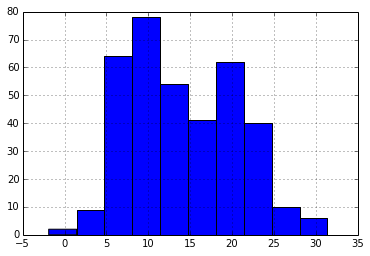
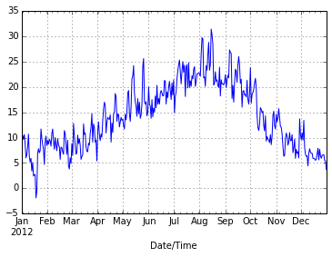
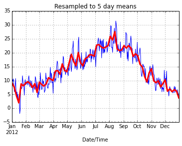

# Weather with Pandas
__Neil.Swart@ec.gc.ca__

This is a basic introduction to pandas using some EC weather station data.
Before starting
download the data using wget:

    wget --output-document=yyj_daily_2012.csv
"http://climate.weather.gc.ca/climateData/bulkdata_e.html? format=csv&stationID=
118&Year=2012&Month=12&day=1&timeframe=2&submit=Download+Data"

or just click on [this EC link](http://climate.weather.gc.ca/climateData/bulkdat
a_e.htmlformat=csv&stationID=118&Year=2012&Month=12&day=1&timeframe=2&submit=Dow
nload+Data) and save the file as yyj_daily_2012.csv

Some of this was taken from a similar tutorial, which documents even more
functionality:

[http://nbviewer.ipython.org/github/swcarpentry/bc/blob/gh-pages/lessons/misc-
pandas/an-introduction-to-pandas.ipynb]

Of course also check out the official docs:
[http://pandas.pydata.org/]

First off lets load up our required modules, including pandas.

    import re
    import pandas as pd
    from datetime import datetime
    import matplotlib.pyplot as plt
    plt.close('all')
    %matplotlib inline  

Read in the yyj daily weather data from CSV into a
Pandas dataframe. Skip the first 24 rows which are
unwanted header. Columns headers will be inferred.

    df = pd.read_csv('yyj_daily_2012.csv',skiprows=24)

Lets look at some properties of the dataframe, like its shape. Many similar
methods to numpy arrays, but many more too...First, get the shape:

    df.shape

    (366, 27)

Lets see what the columns are

    df.columns

    Index([u'Date/Time', u'Year', u'Month', u'Day', u'Data_Quality', u'Max_Temp', u'Max_Temp_Flag', u'Min_Temp', u'Min_Temp_Flag', u'Mean_Temp', u'Mean_Temp_Flag', u'Heat_Deg_Days', u'Heat_Deg_Days_Flag', u'Cool_Deg_Days', u'Cool_Deg_Days_Flag', u'Total_Rain', u'Total_Rain_Flag', u'Total_Snow', u'Total_Snow_Flag', u'Total_Precip', u'Total_Precip_Flag', u'Snow_on_Grnd', u'Snow_on_Grnd_Flag', u'Dir_of_Max_Gust', u'Dir_of_Max_Gust_Flag', u'Spd_of_Max_Gust', u'Spd_of_Max_Gust_Flag'], dtype='object')

Lets look at some mean statistics. Max, Min, Std, and others are available too.

    df.mean()

    Year                         2012.000000
    Month                           6.513661
    Day                            15.756831
    Data Quality                         NaN
    Max Temp (�C)                  14.179508
    Max Temp Flag                        NaN
    Min Temp (�C)                   5.578142
    Min Temp Flag                        NaN
    Mean Temp (�C)                  9.902186
    Mean Temp Flag                       NaN
    Heat Deg Days (�C)              8.173224
    Heat Deg Days Flag                   NaN
    Cool Deg Days (�C)              0.075410
    Cool Deg Days Flag                   NaN
    Total Rain (mm)                 2.597541
    Total Snow (cm)                 0.037705
    Total Precip (mm)               2.633607
    Snow on Grnd (cm)               0.040984
    Dir of Max Gust (10s deg)      19.315789
    dtype: float64

lets access some data, lets say the year field

    df['Year']

    0     2012
    1     2012
    2     2012
    3     2012
    4     2012
    5     2012
    6     2012
    7     2012
    8     2012
    9     2012
    10    2012
    11    2012
    12    2012
    13    2012
    14    2012
    ...
    351    2012
    352    2012
    353    2012
    354    2012
    355    2012
    356    2012
    357    2012
    358    2012
    359    2012
    360    2012
    361    2012
    362    2012
    363    2012
    364    2012
    365    2012
    Name: Year, Length: 366, dtype: int64

only the first 10 years, this time using dot sytax

    df.Year.head(10)

    0    2012
    1    2012
    2    2012
    3    2012
    4    2012
    5    2012
    6    2012
    7    2012
    8    2012
    9    2012
    Name: Year, dtype: int64

statistics of the Total precip field

    df['Total Precip (mm)'].describe()

    count    366.000000
    mean       2.633607
    std        5.164477
    min        0.000000
    25%        0.000000
    50%        0.000000
    75%        2.800000
    max       29.800000
    Name: Total Precip (mm), dtype: float64

The columns names are a little unweildy, so lets replace them with something
better:
For each column name, lets strip out the wierd unit and spaces and replace
spaces with underscores
and store the result in a list called dcol. This is just a python trick, not
really pandas. You could
just write a list of names if you wanted.

    dcol = [ re.sub(r'\(.*?\)', '', col).strip(' ').replace(' ', '_') for col in df.columns ]
    # now lets replace our old columns headers with dcol in the pandas dataframe. Remember, dcol
    # could be any list of names you make up, as long as it is a list containing the correct number strings = # columns.
    
    df.columns = dcol
    
    # check that it worked
    df.columns

    Index([u'Date/Time', u'Year', u'Month', u'Day', u'Data_Quality', u'Max_Temp', u'Max_Temp_Flag', u'Min_Temp', u'Min_Temp_Flag', u'Mean_Temp', u'Mean_Temp_Flag', u'Heat_Deg_Days', u'Heat_Deg_Days_Flag', u'Cool_Deg_Days', u'Cool_Deg_Days_Flag', u'Total_Rain', u'Total_Rain_Flag', u'Total_Snow', u'Total_Snow_Flag', u'Total_Precip', u'Total_Precip_Flag', u'Snow_on_Grnd', u'Snow_on_Grnd_Flag', u'Dir_of_Max_Gust', u'Dir_of_Max_Gust_Flag', u'Spd_of_Max_Gust', u'Spd_of_Max_Gust_Flag'], dtype='object')

now use dot sytax to get some data

    df.Max_Temp

    0      6.6
    1     10.4
    2      9.7
    3     10.6
    4      8.8
    5      6.0
    6      6.6
    7      8.1
    8     10.7
    9      6.3
    10     5.2
    11     5.9
    12     3.4
    13     5.1
    14     2.4
    ...
    351    5.8
    352    5.5
    353    5.8
    354    6.9
    355    7.9
    356    5.6
    357    7.7
    358    6.4
    359    5.9
    360    6.5
    361    6.6
    362    6.6
    363    5.5
    364    5.4
    365    3.7
    Name: Max_Temp, Length: 366, dtype: float64

lets look at that data in a histogram

    df.Max_Temp.hist()

    <matplotlib.axes.AxesSubplot at 0x4de8d90>

    Ok, now lets look at the "index", currently the index is an integer.

    df.index

    <class 'pandas.tseries.index.DatetimeIndex'>
    [2012-01-01, ..., 2012-12-31]
    Length: 366, Freq: None, Timezone: None

thats okay, but it turns out to be useful to use the datetime as the index.
let write a function that converts our first column, the string Date/Time into
an actual
python datetime object.

    # Define a function to convert strings to dates
    def string_to_date(date_string):
        return datetime.strptime(date_string, "%Y-%m-%d")

Run the function on every date string and overwrite the column

    df.date = df['Date/Time'].apply(string_to_date)
    df.date.head()

    0   2012-01-01
    1   2012-01-02
    2   2012-01-03
    3   2012-01-04
    4   2012-01-05
    Name: Date/Time, dtype: datetime64[ns]

Now lets replace our dataframes index with the date field

    df.index = df.date

check that it worked

    df.index

    <class 'pandas.tseries.index.DatetimeIndex'>
    [2012-01-01, ..., 2012-12-31]
    Length: 366, Freq: None, Timezone: None

Actually, we are being inefficient. When we loaded the dataframe,
we could have told pandas to parse the dates and use them. But
the above example shows how you can define a function and apply
it to every line in a dataframe.

Okay, now that we have the index as datetimes, it allows us to do some neat
filetering and plotting. Lets start by doing a seasonal decomposition. Lets find
the max temp in summer (JJA):

    df.jja = df[ ( df.index.month >= 6 ) & ( df.index.month <= 8 )]
    df.jja.Max_Temp.max()

    31.399999999999999

Lets find information on 18th July. To do this we will use ix, and pass it the
datetime for 18 July.

    df.ix[ datetime(2012, 6, 18) ]

    Date/Time               2012-06-18
    Year                          2012
    Month                            6
    Day                             18
    Data_Quality                   NaN
    Max_Temp                      18.2
    Max_Temp_Flag                  NaN
    Min_Temp                       9.5
    Min_Temp_Flag                  NaN
    Mean_Temp                     13.9
    Mean_Temp_Flag                 NaN
    Heat_Deg_Days                  4.1
    Heat_Deg_Days_Flag             NaN
    Cool_Deg_Days                    0
    Cool_Deg_Days_Flag             NaN
    Total_Rain                     1.5
    Total_Rain_Flag                NaN
    Total_Snow                       0
    Total_Snow_Flag                NaN
    Total_Precip                   1.5
    Total_Precip_Flag              NaN
    Snow_on_Grnd                     0
    Snow_on_Grnd_Flag              NaN
    Dir_of_Max_Gust                 25
    Dir_of_Max_Gust_Flag             E
    Spd_of_Max_Gust                 39
    Spd_of_Max_Gust_Flag             E
    Name: 2012-06-18 00:00:00, dtype: object

Lets look only for days that are nice and warm, lets say Mean_Temp > 18. We'll
request the index so we get a print out of the datetimes.

    df[ df.Mean_Temp > 18 ].index

    <class 'pandas.tseries.index.DatetimeIndex'>
    [2012-07-08, ..., 2012-09-08]
    Length: 16, Freq: None, Timezone: None

Lets do some basic plotting:

    df.Max_Temp.plot()

    <matplotlib.axes.AxesSubplot at 0x4e2a2d0>

Do a bar plot of total precip on days warmer than 12C, if precip > 0

    df[ ( df.Mean_Temp > 15) & (df.Total_Precip > 0) ].Total_Precip.plot(kind="barh", rot=10)

    <matplotlib.axes.AxesSubplot at 0x5417210>

Lets resample to a 5 day interval and then plot the result

    df.Max_Temp.plot(linewidth=1)
    df.Max_Temp.resample('5d').plot(color='r',linewidth=3)
    plt.title('Resampled to 5 day means')

    <matplotlib.text.Text at 0x58a7310>

    
